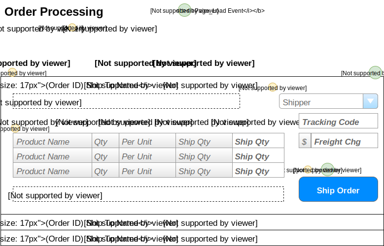

# Order Processing

> Orders are shipped directly from our suppliers to our customers. As such, suppliers log onto our system to see what orders there are for the products that they provide.

## User Interface

Suppliers will be interacting with a page that shows the following information.


The information shown here will be displayed in a **ListView**, using the *EditItemTemplate* as the part that shows the details for a given order.

## Events and Interactions


- **Page_Load** event
    -  - Supplier/Contact names obtained by who the logged in user is.
    -  - Load the ListView data
        - **`List<OutstandingOrder>OrderProcessingController.LoadOrders(supplierID)`**
    -  - Load the list of shippers from BLL
        - **`List<ShipperSelection>OrderProcessingController.ListShipers()`**
-  - **EditCommand** click event
    - Default EditCommand behaviour of the ListView 
    - `<EditItemTemplate>` will display the extended information of the products  and other details of the order.
-  **ShipOrder** click
    - Use a custom command name of "ShipOrder" and handle the ListView's `ItemCommand` event. 
    - Gather information from the form of the products to be shipped and the shipping information. This is sent to the following method in the BLL for processing:
```csharp
void OrderProcessingController.ShipOrder(int orderId, ShippingDirections shipping, List<OrderItem> items)
```
## POCOs
```C#
public class OrderItem
{
    public int ProductID {get;set;}
    public string ProductName {get;set;}
    public short Qty {get;set;}
    public short QtyPerUnit {get;set;}
    public short Outstanding {get;set;} //Calculated as OD.Quantity - Sum(Shipped qty)
}
```
### Commands
```C#
public class ShippingDirections
{
    public int ShipperId { get; set; }
    public string TrackingCode { get; set; }
    public decimal? FreightCharge { get; set; }
}
public class ProductShipment
{
    public int ProductId { get; set; }
    public int ShipQuantity { get; set; }
}
```
### Queries
```C#
public class ShipperSelection
{
    public int ShipperId { get; set; }
    public string Shipper { get; set; }
}
public class OutstandingOrder
{
    public int OrderId { get; set; }
    public string ShipToName { get; set; }
    public DateTime OrderDate { get; set; }
    public DateTime RequiredBy { get; set; }
    public TimeSpan DaysRemaining { get; } // Calculated
    public IEnumerable<OrderProductInformation> OutstandingItems { get; set; }
    public string FullShippingAddress { get; set; }
    public string Comments { get; set; }
}
public class OrderProductInformation
{
    public int ProductId {get;set;}
    public string ProductName {get;set;}
    public short Qty {get;set;}
    public string QtyPerUnit {get;set;}
    public short Outstanding {get;set;}
    // NOTE: Outstanding <= OrderDetails.Quantity - Sum(ManifestItems.ShipQuantity) for that product/order
}
```
## BLL Processing
